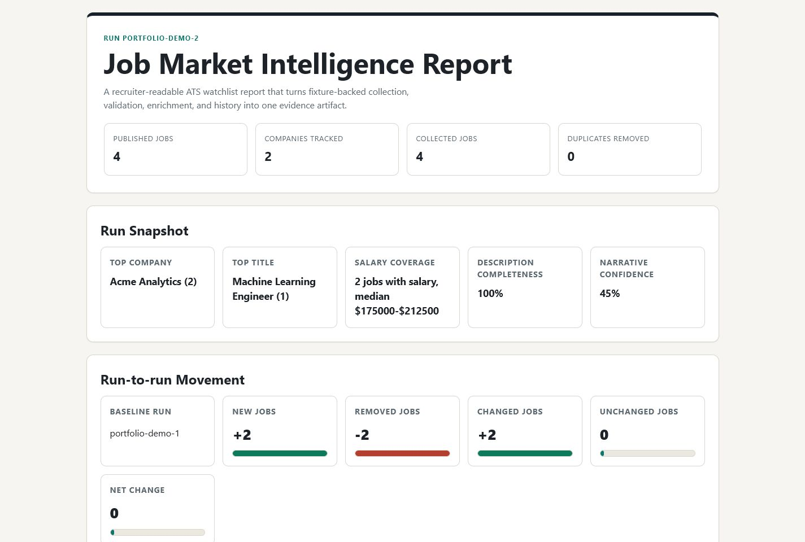
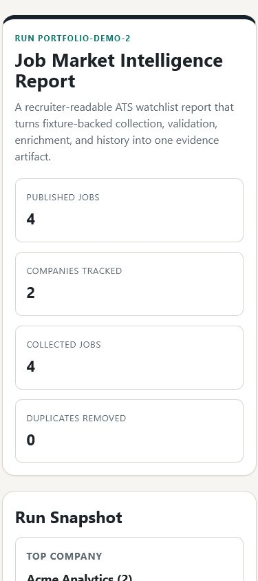

# Job Market Intelligence Pipeline

Python CLI pipeline that collects jobs from ATS-backed company career pages, normalizes and validates the data, applies narrow optional AI enrichment, and exports structured datasets plus hiring-trend reports.

The project is intentionally shaped as a reliable data workflow rather than a brittle "scrape everything" demo. It focuses on reproducibility, validation, history, and business-facing reporting.

## Why It Exists

- Targets first-party ATS sources backed by Greenhouse and Lever
- Uses a staged pipeline: collect, validate, enrich, report, and history
- Produces structured outputs, manifests, quality reports, delta reports, and trend summaries
- Persists comparable historical snapshots in DuckDB
- Uses optional AI only where deterministic rules are weak or ambiguous
- Includes fixture-backed tests so the demo path stays reproducible without live network dependencies

## Tech Stack

- Python
- `requests`
- `BeautifulSoup`
- `duckdb`
- `pandas`
- `pydantic`
- `PyYAML`
- `tenacity`
- `typer`
- `pytest`

## Architecture

```text
src/jobintel/
  cli.py
  config.py
  domain/models.py
  sources/{base,greenhouse,lever}.py
  pipeline/{collect,validate,enrich,report}.py
  validation/{normalize,rules,dedupe}.py
  enrichment/{skills,classification,llm_client,prompts}.py
  reporting/{metrics,quality,render}.py
  storage/{artifacts,manifests}.py
  observability/logging.py
tests/
  contracts/
  unit/
  e2e/
  fixtures/
```

## Pipeline

1. Collect
   - Pulls public ATS-backed job data for configured companies
   - Stores raw source snapshots under `data/raw/<run_id>/`
2. Validate
   - Cleans HTML
   - Canonicalizes URLs
   - Normalizes location, employment type, and salary fields
   - Applies validation rules and quarantines invalid rows
   - Removes duplicates
3. Enrich
   - Extracts skills from a curated keyword taxonomy
   - Infers role family and seniority deterministically
   - Optionally calls the OpenAI Responses API for ambiguous cases only
4. Report
   - Builds market metrics and data-quality summaries
   - Compares the current run to the latest stored baseline
   - Exports CSV, JSON, markdown, and HTML outputs for the current run
5. History
   - Builds multi-run trend reports from the history store for comparable runs

## Source Strategy

The first release targets `Greenhouse` and `Lever` because they are closer to the source of truth, easier to maintain than public job boards, and better suited to a dependable ETL-style portfolio project.

The project does not use browser automation in v1. If a target source becomes JS-only or blocks clean access, that should be treated as a separate v2 concern.

## AI Usage

AI is intentionally narrow.

- Not used for HTML parsing
- Not used for validation or deduplication
- Not used for deterministic metrics
- Used only for optional text classification and report narration when rules are weak or ambiguous

If `OPENAI_API_KEY` is not present, the pipeline still runs end-to-end with deterministic fallbacks.

## Quick Start

### 1. Install dependencies

```bash
python -m pip install -r requirements.txt
python -m pip install -e .
```

### 2. Run the offline demo

This uses frozen fixtures and produces deterministic local sample outputs.

```bash
jobintel run --config config/companies.fixtures.yaml --run-id demo
```

For a two-run verification demo with historical deltas:

```bash
jobintel run --config config/verification/companies.fixtures.run1.yaml --run-id portfolio-demo-1
jobintel run --config config/verification/companies.fixtures.run2.yaml --run-id portfolio-demo-2
jobintel history --config config/verification/companies.fixtures.run2.yaml --run-id portfolio-history --limit 10
```

### 3. Run with live ATS-backed sources

Edit [`config/companies.example.yaml`](config/companies.example.yaml) and then run:

```bash
jobintel run --config config/companies.example.yaml --run-id live-20260326
```

### 4. Enable optional AI

Copy `.env.example` to `.env`, fill the OpenAI key locally, and set `ai.enabled: true` in the config file. The `.env` file is ignored and should never be committed.

## Verified Demo Evidence

The portfolio verification path uses synthetic Greenhouse and Lever fixtures, then writes the latest report, data-quality outputs, run manifests, and DuckDB history under ignored local artifact folders.

Desktop report screenshot:



Responsive report screenshot:



The verified fixture run currently demonstrates:

- 4 published jobs across 2 companies
- 100% description, location, and posted-date completeness
- 2 new jobs, 2 removed jobs, and 2 changed jobs in the second run
- deterministic enrichment fallback with optional AI disabled
- generated markdown, HTML, JSON, CSV, manifest, and DuckDB history outputs

Reviewer path:

1. Run the two fixture-backed commands in the Quick Start section.
2. Open `artifacts/verification/20260326/reports/market_summary.html`.
3. Check `artifacts/verification/20260326/reports/history_trend_report.md` for the two-run comparison.
4. Inspect `artifacts/verification/20260326/manifests/runs/portfolio-demo-2/manifest.json` to confirm which files were produced.
5. Review the screenshots above to understand the report shape before running the pipeline locally.

What the fixture demo proves:

- the pipeline can collect from both Greenhouse-shaped and Lever-shaped inputs without live network access
- validation, dedupe, enrichment, reporting, manifests, and history run in one CLI flow
- the second run produces comparable deltas instead of a single static export
- optional AI remains disabled in the reproducible demo path

## CLI Commands

```bash
jobintel collect --config config/companies.example.yaml --run-id run-001
jobintel validate --config config/companies.example.yaml --run-id run-001
jobintel enrich --config config/companies.example.yaml --run-id run-001
jobintel report --config config/companies.example.yaml --run-id run-001
jobintel history --config config/companies.example.yaml --limit 10
jobintel run --config config/companies.example.yaml --run-id run-001
```

## Outputs And Artifact Policy

The pipeline writes local run artifacts under:

- `data/raw/`
- `data/processed/`
- `reports/`
- `artifacts/manifests/`
- `artifacts/history/`

These are generated run outputs, not source-of-truth repo files. They should stay local or be curated intentionally before any public sharing.

Each run stores:

- raw payload snapshots
- processed job exports
- data quality reports
- delta reports
- markdown and HTML summaries
- run manifests
- DuckDB history snapshots

## Historical Tracking

The pipeline stores curated run snapshots in DuckDB and compares each run against the latest prior run in the same history scope.

This enables:

- `new_jobs`
- `removed_jobs`
- `changed_jobs`
- skill movers between runs
- reusable historical snapshots for trend analysis

Example sequential flow:

```bash
jobintel run --config config/companies.fixtures.yaml --run-id demo-1
jobintel run --config config/companies.fixtures.run2.yaml --run-id demo-2
```

The second run populates the delta report and adds a baseline comparison section to the markdown and HTML summaries.

You can also generate the aggregated history report directly:

```bash
jobintel history --config config/companies.fixtures.yaml --limit 10
```

If you maintain multiple config files for the same watchlist, set a shared `history_scope` so their runs stay comparable even when fixture paths, AI settings, or output directories differ.

Do not run two pipeline executions at the same time against the same DuckDB file. The history store is intended for sequential CLI runs.

## Validation Rules

The validation layer currently covers:

- required company, title, and canonical URL fields
- URL canonicalization and tracking-param cleanup
- posted-date sanity checks
- salary range parsing and inversion checks
- HTML cleaning and boilerplate removal
- location normalization
- employment type normalization
- duplicate detection via canonical URL, content hash, and description similarity

## Testing

Run the test suite with:

```bash
pytest
```

Coverage includes:

- parser contract tests for Greenhouse and Lever fixtures
- normalization and salary parsing tests
- dedupe tests
- mocked AI enrichment tests
- DuckDB history and delta tests
- HTML reporting tests
- end-to-end CLI smoke test with multi-run delta coverage

## Container And CI

Build the package locally:

```bash
python -m build
```

Build the container image:

```bash
docker build -t job-market-intel:local .
```

CI runs tests and package builds through `.github/workflows/ci.yml`.

## Portfolio Positioning

- Emphasize reliability, validation, and reproducibility, not just scraping
- Explain why ATS-backed sources were chosen over public job boards
- Position the AI layer as deliberately narrow and non-authoritative
- Use the fixture-backed run in demos to avoid flaky live dependencies
- Show run-over-run delta reporting as the clearest upgrade over a simple scraper

## Release And Security

- Keep secrets, generated outputs, logs, and DuckDB history out of the public repo surface
- Treat live ATS access and optional OpenAI enrichment as environment-dependent behavior
- Use the deterministic fixture path as the default demo path
- Security expectations and disclosure guidance live in [SECURITY.md](SECURITY.md)

## Current Limits

- Batch-oriented CLI workflow, not a hosted multi-tenant application
- No browser automation for JS-heavy targets
- No built-in scheduling or orchestration layer
- Optional AI path depends on external credentials and should stay explicitly bounded
